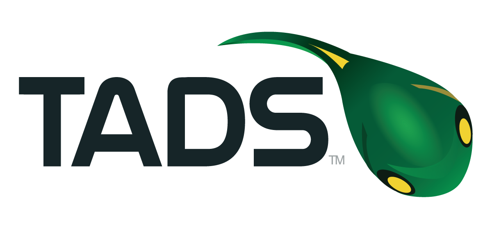

<p align="center">
  <a href="https://www.tadsummit.com">
    
  </a>
</p>

# TADSummit 2021 EMEA/AMERICAS

This year for [TADSummit 2021](https://www.tadsummit.com/2021/), we are running a workshop. Follow the following steps to take full advance of the event:

Save your spot [here](bit.ly/3FoFRvu) 👈👈👈👈

## Join the #tadsummit channel on Slack

To take full advantage of the workshop, we ask that you join our Slack community. We will be sharing information with access to Virtual Numbers and credentials, which you will need during the workshop. To join the community, simply follow the link:

https://join.slack.com/t/fonoster/shared_invite/zt-b6n7hrwz-PJT9SXg_RRR9Q1gI7DI6kA

## Install NodeJS

The next item you will need is NodeJS `+v14.16.0`. If possible use [NVM](https://github.com/nvm-sh/nvm) to install NodeJS.

## Install the Command-line Tool and the Plugins

You will also need the Fonoster command-line and the "phone" plugin. To install the tools, run the following commands:

```bash
npm install -g @fonoster/ctl
```

Then, 

```bash
fonoster plugins:install @fonos/plugin-phone
```

## Create a Fonoster Account

Finally, you will need a Fonoster account from https://console.fonoster.io/.

You are all set, but if you want to start experimenting with API, you can head to the [learning page](https://learn.fonoster.com/) at Fonoster.
